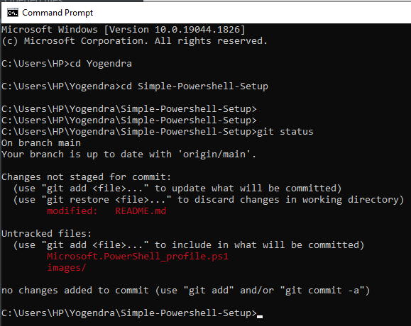
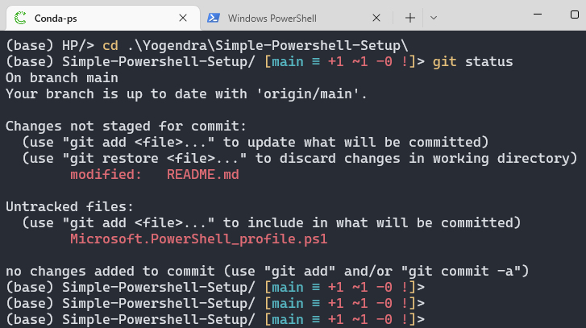

# Simple-Powershell-Setup

#### <mark>**Initial**:</mark>



#### <mark>**Final**: </mark>

<mark>(Anaconda Environment Status + Only Current Directory + Entire Git Status + Tabs)</mark>



---

### **Background**:

I am a ML developer and my current professional as well as my personal development setup is on Windows10 and Windows11. As a developer, terminal is an essential part of my daily life where I use the below listed things:

- Windows Powershell on the new Windows Terminal

- Anaconda Python

- Git

- Docker

- Vim + terminal based file processing and searching

- etc...etc....etc

---

### **Need**:

- If I am inside a deep nested file-path, the terminal readability reduces

- No Git status

- Coolness factor is reduced

---

### **Steps:**

1. [Install New Windows Terminal:](https://github.com/microsoft/terminal)
   
   - Easiest way to install is Microsoft Store or Windows Package Manager (I prefer this)
   
   - **Winget Command**: 
   
   - ```powershell
     winget install --id=Microsoft.WindowsTerminal  -e
     ```

2. [Install Git:](https://gitforwindows.org/?ref=winstall)
   
   - Install from the website or my preferred way is: Winget (Windows package manager)
   
   - **Winget Command:** 
   
   - ```powershell
     winget install --id=Git.Git  -e
     ```

3. **Install your needed files:**
   
   - **Mine were**: Docker, Anaconda (for Tensorflow, Pytorch, Numpy, Pandas, infinite etc)
   
   - After installing Anaconda package manager, I linked it to powershell (I had to waste a lot of time in this but it happened finally)

4. [Install Posh-Git and enable it in the Powershell Profile:](https://github.com/dahlbyk/posh-git#installation)
   
   - If you don't have Powershell Profile, follow below:

5. [Creation of Powershell Profile:](https://docs.microsoft.com/en-us/powershell/module/microsoft.powershell.core/about/about_profiles?view=powershell-7.2#how-to-create-a-profile)
   
   - ```powershell
     if (!(Test-Path -Path $PROFILE)) {
       New-Item -ItemType File -Path $PROFILE -Force
     }
     ```

6. **Edit the Profile:**
   
   - ```powershell
     notepad $PROFILE
     ```
   
   - [Microsoft.PowerShell_profile.ps1](./Microsoft.PowerShell_profile.ps1) 
     Put the below text within that file: 
   
   - ```powershell
     Import-Module posh-git
     
     Function Prompt {"$( ( get-item $pwd ).Name)/$(Write-VcsStatus)> "}
     ```

---

### WE ARE DONE.

<u>***This will also work for standalone Powershell interface***</u>.
